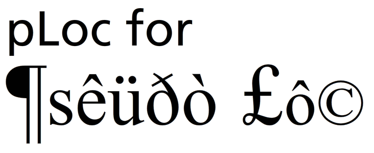

pLoc
====
A simple Pseudo-Localizing script 

Usage:
* Point to the script:  
* Use the pLoc.toPseudo() method like:  var result = pLoc.toPseudo("this is my input");
* Get excited: þéçáúsé thís ís p®éttý úséfúl.

Example (same as example.html):
* http://phillipkerman.com/pLoc/

Blog post from where I used it originally:
* http://phillipkerman.com/blog/?p=8